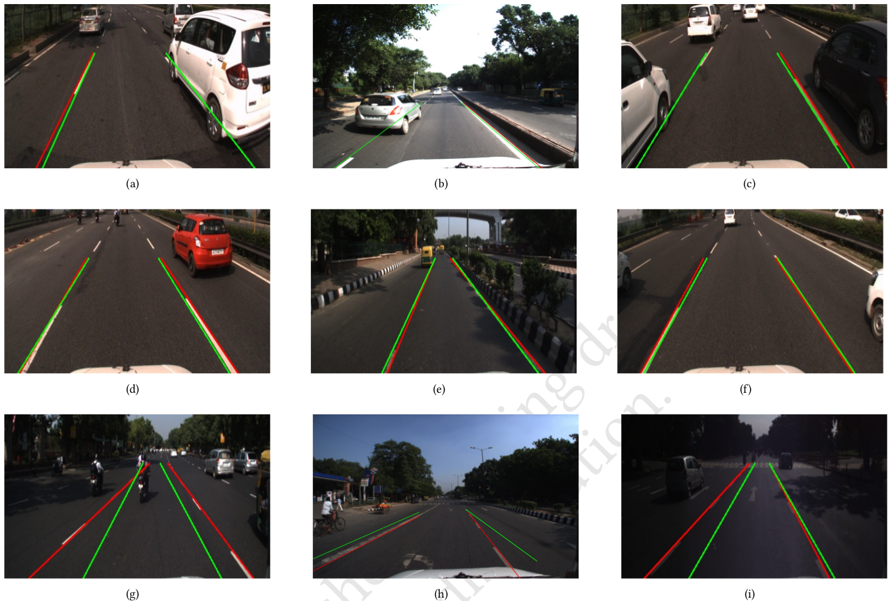

# Robust Lane Detection and Tracking for Autonomous Vehicle

A robust lane-detection and tracking framework is an essential
component of an advanced driver assistant system, for autonomous
vehicle applications. The problem of lane detection and tracking in-
cludes challenges such as varying clarity of lane markings, change
in visibility conditions like illumination, reflection, shadows etc.
In this paper, a robust and real-time vision-based lane detection
and tracking framework is proposed. The proposed framework
consists of lane boundary candidate generation based on extended
hough transform and CNN based lane classification model for de-
tection. Additionally, a Kalman filter is used for lane tracking. The
framework is trained and evaluated on the data collected by our
experimental vehicle on Indian roads. The dataset consists of a total
of 4500 frames with varying driving scenarios, including highways,
urban roads, traffic, shadowed lanes, partially visible lanes and
curved lanes. The performance of our approach is demonstrated
using quantitative evaluation (recall, precision etc.) using manually
labeled images.

<b>Figure 1: Proposed lane detection and tracking framework</b>

## Candidate lane image patch extraction

Once the lane candidates
are generated by extended HT, the next step is to classify
true lane and remove outliers. Since a CNN based model is employed for this task, the lane candidates need
to be extracted in the form of fixed sized images which can be fed
into the model. An offset of 15 pixels is taken on either side of
the lane candidate boundary and the corresponding image patch is
extracted.The image patches are further scaled to 224x224x3 and output is a Nx224x224x3 vector.

### Code

***lane_ros_package/*** :  Contains the ROS workspace with **Lane_DetectorNode**(C++ node) subscribing to camera feed publishing the candidate lane patches, which is subscribed by **run_py_node**(Python node) which
is used to do inference using the trained alexnet to classify and apply Kalman filter for tracking the lanes.

***training/train_alex.py*** : This is used to finetune the imagenet pretrained Alexnet model with collected Indian dataset.

***preprocessing/aug_new.py*** : Data augmentation using techniques like
horizontal flip, Gaussian blur followed by sharpening, apply shear
with added Gaussian noise and image darkening.

***preprocessing/extract_image.py*** : Used to extract candidate lane patches.

## Results

### Lane classification results

<b>Figure 2:  a) in presence of shadow b) on curved roads c) in traffic d) in the presence of other signs
on roads e) on highway</b>

### Tracking results

<b>Figure 3: Performance of Kalman filter (KF) for lane tracking (detected: red, predicted by KF: green)</b>

