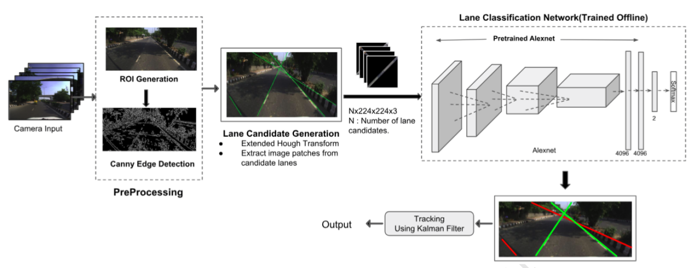
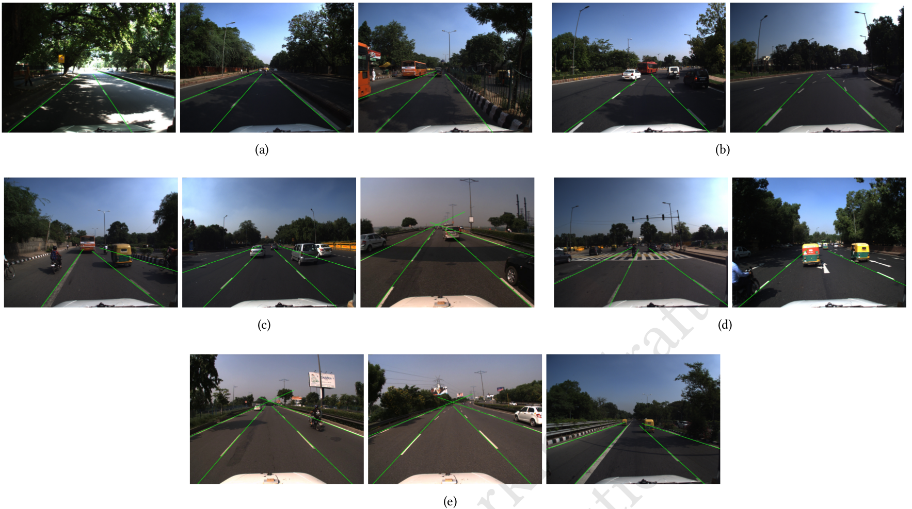

# Robust Lane Detection and Tracking for Autonomous Vehicle

A robust lane-detection and tracking framework is an essential
component of an advanced driver assistant system, for autonomous
vehicle applications. The problem of lane detection and tracking in-
cludes challenges such as varying clarity of lane markings, change
in visibility conditions like illumination, reflection, shadows etc.
In this paper, a robust and real-time vision-based lane detection
and tracking framework is proposed. The proposed framework
consists of lane boundary candidate generation based on extended
hough transform and CNN based lane classification model for de-
tection. Additionally, a Kalman filter is used for lane tracking. The
framework is trained and evaluated on the data collected by our
experimental vehicle on Indian roads. The dataset consists of a total
of 4500 frames with varying driving scenarios, including highways,
urban roads, traffic, shadowed lanes, partially visible lanes and
curved lanes. The performance of our approach is demonstrated
using quantitative evaluation (recall, precision etc.) using manually
labeled images.

<b>Figure 1: Proposed lane detection and tracking framework</b>

### Candidate lane image patch extraction

Once the lane candidates
are generated by extended HT, the next step is to classify
true lane and remove outliers. Since a CNN based model is employed for this task, the lane candidates need
to be extracted in the form of fixed sized images which can be fed
into the model. An offset of 15 pixels is taken on either side of
the lane candidate boundary and the corresponding image patch is
extracted.The image patches are further scaled to 224x224x3 and output is a Nx224x224x3 vector.

### Lane Classification Model
Once we get all lane candidates the subsequent task is to identify the correct lanes(True positives) and eliminate the outliers i.e false candidates(True negatives).We use a deep convolutional neural network called AlexNet fpr this task.

**Training** : The model is trained offline on 16000 images which are labeled into two classes, "True Lane" and "False Lane".We replace the final fully connected layer(1000 neurons) in AlexNet with a 2 neuron fully connected layer followed by softmax.The network is fine tuned to minimize the cross entropy loss using the SGD(Stochastic gradient descent) optimizer with initial learning rate of 0.001,momentum = 0.9 and weight_decay =0.0001(after every 12 epochs.Using a pretrained AlexNet model helped in faster convergence of the model.

**Inference** : During the inference the framework gets in input from previous image patch extraction module in form of Nx224x224x3 shaped vector.N is the number of lane candidates generated by the Extended Hough Transform .The output is a 1xN vector with predicted label.

### Results

#### Lane classification results

<b>Figure 2:  a) in presence of shadow b) on curved roads c) in traffic d) in the presence of other signs
on roads e) on highway</b>

#### Tracking results

<b>Figure 3: Performance of Kalman filter (KF) for lane tracking (detected: red, predicted by KF: green)</b>

### Experimental Results and Discussion
Fig 2 shows lane detection results by the classification model which
is run on the entire database consisting of 4500 images. The frame-
work is run on a system equipped with a Quad-core 2.4GHz Intel
i7 − 5500U CPU paired with 8GB DDR3 RAM and NVIDIA Titan X
GPU which gives an average processing speed of 0.0262 sec/frame
i.e 38fps, while running on a low end GPU NVIDIA GeForce 920M
it runs at an average speed of 10-12fps. The model performs ro-
bustly and is able to adapt to various lane conditions like shadowed
lanes, traffic conditions where some part of the lane is covered by
a vehicle as shown in Fig. 2(a) and Fig. 2(c) respectively. It works
well on highway roads as shown in Fig. 2(e), detecting all lanes in
comparatively less traffic conditions.Though currently not designed
for curved roads with steep curvature, it works well for roads with
small curvature as shown in Fig. 2(b). Since the detection module
performs well in detecting multiple lanes, this method is scalable
for multiple lane detection and tracking. 

Fig. 3 shows the tracking result in different scenarios. In Figs.
3(a), 3(b) and 3(c), the Kalman filter based tracker correctly predicts
the true lane even in scenarios where the lane is occluded by a
vehicle and thus a detection failure occurs. Figs. 3(d),3(e) and 3(f)
represent the general case of performance of tracking, where as
expected, tracking and detection outputs are similar. As seen in Figs.
3(g), 3(h) and 3(i), the estimate tends to drift from the correct lane
location during and/or just after a lane change. We have empirically
observed that it stabilizes after 4 to 5 frames after lane change.

### Code

***lane_ros_package/*** :  Contains the ROS workspace with **Lane_DetectorNode**(C++ node) subscribing to camera feed publishing the candidate lane patches, which is subscribed by **run_py_node**(Python node) which
is used to do inference using the trained alexnet to classify and apply Kalman filter for tracking the lanes.

***training/train_alex.py*** : This is used to finetune the imagenet pretrained Alexnet model for candidate lane patch classification.

***preprocessing/extract_image.py*** : Used to extract candidate lane patch images from the candidate lanes which are genrated by the Ext. Hough Transform to be further used for training the image classification model.

***preprocessing/aug_new.py*** : Data augmentation using techniques like
horizontal flip, Gaussian blur followed by sharpening, apply shear
with added Gaussian noise and image darkening.

